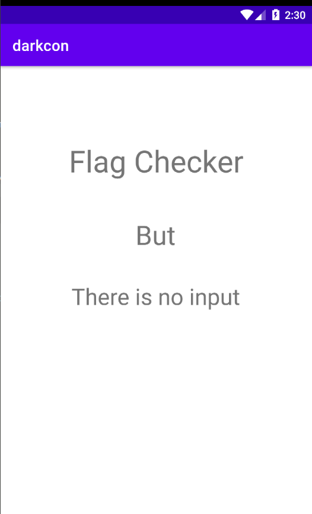

# Fire in the Androiddd (6 solves / 497 points)
To decrypt something we need encrypted stuff

## Attachments:
* [chall.apk](./chall.apk)

## Source Code:
* [Source](https://github.com/karma9874/My-CTF-Challenges/tree/main/DarkCON-ctf/Reverse/Fire_in_the_Androiddd)

## Solution

On running the app there is just a basic with some text and nothing else.



On reversing the apk we have some java files so following the source code of `MyReceiver` we see that its actually waiting for an intent with argument as flag and is latter forwarded to the `loader` class (AsyncTask) which does the checking between the intent's argument and  `magic function from native library`, if the checking is correct then it say correct flag if not then wrong flag.

```java
package com.application.darkcon;

import android.content.BroadcastReceiver;
import android.content.Context;
import android.content.Intent;
import android.os.AsyncTask;
import android.widget.Toast;


public class MyReceiver extends BroadcastReceiver {
    @Override
    public void onReceive(Context context, Intent intent) {
        String data =  intent.getStringExtra("flag");

        if(data_receiver.data != null && data != null){
            new loader(context).execute(data,data_receiver.data);
        }else{
            Toast.makeText(context, "Something went wrong", Toast.LENGTH_LONG).show();
        }
    }

    class loader extends AsyncTask<String,Void,Boolean> {
        Context context;

        public loader(Context context){
            this.context = context;
        }
        @Override
        protected void onPreExecute() {
            super.onPreExecute();
            Toast.makeText(context, "Checking your flag", Toast.LENGTH_SHORT).show();
        }

        @Override
        protected Boolean doInBackground(String... strings) {
            String[] parts = strings[1].split(",");
            long[] ints = new long[parts.length];
            for (int i = 0; i < parts.length; i++)ints[i] = Long.parseLong(parts[i]);
            return magic(strings[0].getBytes(),ints);
        }

        @Override
        protected void onPostExecute(Boolean aBoolean) {
            if(aBoolean){
                Toast.makeText(context, "Well thats the correct flag ", Toast.LENGTH_SHORT).show();
            }else{
                Toast.makeText(context, "Nope wrong flag :(", Toast.LENGTH_SHORT).show();
            }

        }
    }
    static {
        System.loadLibrary("native-lib");
    }
    public native boolean magic(byte[] str,long[] str1);
}

```

We can find the more details in AndroidManifest.xml file 
```xml
<receiver android:name="com.application.darkcon.MyReceiver" android:exported="true" android:enabled="true">
    <intent-filter>
    <action android:name="flag_checker"/>
    </intent-filter>
</receiver>
```

As we can see the `android:exported` is true so that we can call the `flag_checker` intent from anywhere

By running this we can get the prompt of wrong flag
```bash
adb shell am broadcast -a flag_checker -n com.application.darkcon/.MyReceiver --es flag "testing123"
```
So moving on to the native-lib

Magic function takes two arguments byte string array and long array, the first argument is the intents flag input and 2nd argument is taken from static variable of `data_receiver.data`, so from `data_receiver` class we see that it is again the basic firebase data fetch method but this time the fetched data is stored into the static variable `data`,

```java
public class data_receiver {
    public static String data;

    public void getData() {

        FirebaseFirestore firebaseFirestore = FirebaseFirestore.getInstance();
        firebaseFirestore.collection("encryption").get().addOnFailureListener(new OnFailureListener() {
            @Override
            public void onFailure(@NonNull Exception e) {
                data = null;
            }
        }).addOnCompleteListener(new OnCompleteListener<QuerySnapshot>() {
            @Override
            public void onComplete(@NonNull Task<QuerySnapshot> task) {
                if(task.isSuccessful()){
                    QuerySnapshot snapshot = task.getResult();
                    for(DocumentSnapshot snapshot1 : snapshot){
                        data = snapshot1.getString("encrypted_flag");
                    }
                }
            }
        });
    }
}
```

So to check the data we can use `frida dynamic hooking method` to catch the value from `data` variable using a simple frida script

```py
import frida, sys
import time

def my_message_handler(message , payload): 
    print(message)
    print(payload)


jscode = """
setImmediate(function() {
setTimeout(test, 1000);
});

function test(){
    Java.perform(function(){
        var a=Java.use("com.application.darkcon.data_receiver");
        console.log(a.data.value);
});
}
"""
process = frida.get_usb_device().attach('com.application.darkcon')
script = process.create_script(jscode)

print('[ * ] Frida Running')

script.on("message" , my_message_handler)

script.load()
input()
```

This script will return the value of `data` variable of class data_receiver as 

```
101,96,112,110,77,101,202,470,1506,4758,16815,58877,208123,742855,2674489,9694735,35357570,129644713,477638735,1767263206,2269153033,2991430638,1288250377,3757197244,1413958429,43422424,2072914473,2325361044,2600037558,3008195127,3276256895,4169229947,300814809,3929270464,2526730686,2527522239,645964816,1351610749,573153031,1347646066,1945953402,3824419424,480774039,2833665279,2366904092,2809807660,3295802436,3644429150,720643560,906311378,992169127,1211139059,1465960990,4269303883,3179939394,4095898594,580984841,3596758568,1063564231,3288906933
```

So now we have the second argument of `magic function`

Time to reverse the native library `magic function` using ghidra we see that it has two function `Java_com_application_darkcon_MyReceiver_magic` and `looper` function

```c
uint Java_com_application_darkcon_MyReceiver_magic
               (_JNIEnv *param_1,undefined4 param_2,_jarray *param_3,_jarray *param_4)

{
  char cVar1;
  uint uVar2;
  uint uVar3;
  int iVar4;
  int iVar5;
  int iVar6;
  uint uVar7;
  uint local_2c;
  byte local_15;
  
  iVar4 = GetArrayLength(param_1,param_3);
  iVar5 = GetArrayLength(param_1,param_4);
  if (iVar4 == iVar5) {
    iVar5 = GetByteArrayElements(param_1,(_jbyteArray *)param_3,(uchar *)0x0);
    iVar6 = GetLongArrayElements(param_1,(_jlongArray *)param_4,(uchar *)0x0);
    local_2c = 0;
    while ((int)local_2c < iVar4) {
      uVar2 = *(uint *)(iVar6 + local_2c * 8);
      uVar3 = *(uint *)(iVar6 + 4 + local_2c * 8);
      cVar1 = *(char *)(iVar5 + local_2c);
      uVar7 = looper(local_2c);
      if ((uVar2 ^ (int)cVar1 ^ uVar7 | uVar3) != 0) {
        local_15 = 0;
        goto LAB_0001871b;
      }
      local_2c = local_2c + 1;
    }
    local_15 = 1;
  }
  else {
    local_15 = 0;
  }
LAB_0001871b:
  return (uint)local_15;
}
```

In magic function its checking for `param3` == `param4` which means the input should be the same length of `data_receiver.data` variable and then its looping over `param3` size and doing xor of `param_3` and `looper()` and checking with the `data_receiver.data` 

```c
{
  int iVar1;
  int in_GS_OFFSET;
  int aiStack64 [3];
  int local_34;
  int *local_30;
  undefined **local_2c;
  int local_28;
  uint local_24;
  int local_20;
  int *local_1c;
  int local_18;
  
  local_1c = aiStack64;
  local_2c = &__DT_PLTGOT;
  local_18 = *(int *)(in_GS_OFFSET + 0x14);
  local_20 = param_1 + 1;
  iVar1 = -(param_1 * 4 + 0x13 & 0xfffffff0);
  local_30 = (int *)((int)aiStack64 + iVar1);
  *(undefined4 *)((int)aiStack64 + iVar1 + 4) = 1;
  *local_30 = 1;
  local_24 = 2;
  while (local_24 <= param_1) {
    local_30[local_24] = 0;
    local_28 = 0;
    while (local_28 < (int)local_24) {
      local_30[local_24] =
           local_30[local_28] * local_30[(local_24 - local_28) + -1] + local_30[local_24];
      local_28 = local_28 + 1;
    }
    local_24 = local_24 + 1;
  }
  local_34 = local_30[param_1];
  if (*(int *)(in_GS_OFFSET + 0x14) == local_18) {
    return local_34;
  }
  *(undefined4 *)((undefined *)local_1c + -4) = 0x18961;
  __stack_chk_fail();
}
```

If you try to run this code manually this will return some requence like `1, 1, 2, 5, 14, 42, 132, 429, 1430, 4862, 16796....`
With little bit of googling we can find that the code is actually a `catalan number generator`

But the issue is that due to data types its causing int overflow on the large catalan number, so while xoring we need to solve overflow 

Catlan Number generator
```c
#include <iostream>
using namespace std;

unsigned long int catalanDP(unsigned int n)
{
    unsigned long int catalan[n + 1];
    catalan[0] = catalan[1] = 1;
    for (int i = 2; i <= n; i++) {
        catalan[i] = 0;
        for (int j = 0; j < i; j++)
            catalan[i] += catalan[j] * catalan[i - j - 1];
    }

    return catalan[n];
}

int main()
{
    for (int i = 0; i < 60; i++)
        cout << catalanDP(i) << " ";
    return 0;
}
```

```py
catalan_generate = [1, 1, 2, 5, 14, 42, 132, 429, 1430, 4862, 16796, 58786, 208012, 742900, 2674440, 9694845, 35357670, 129644790, 477638700, 1767263190, 6564120420, 24466267020, 91482563640, 343059613650, 1289904147324, 4861946401452, 18367353072152, 69533550916004, 263747951750360, 1002242216651368, 3814986502092304, 14544636039226909, 55534064877048198, 212336130412243110, 812944042149730764, 3116285494907301262, 11959798385860453492, 9057316177202639132, 10713166123620736856, 16342585076431942214, 2689383809735779348, 5102839245063848452, 11119451935032739784, 14452914362348096668, 14071982300670990120, 11142706294756623192, 3114992555900662896, 16682282172542456626, 11604953028367754716, 10347338891492931260, 6533841209031609592, 17577068357745673116, 11934029089710590568, 3367710287996676216, 1700012784093890096, 9253156062895436676, 11766576147974922296, 7683395182710107672, 16195324623391601584, 15200231439582411976]

enc = [101,96,112,110,77,101,202,470,1506,4758,16815,58877,208123,742855,2674489,9694735,35357570,129644713,477638735,1767263206,2269153033,2991430638,1288250377,3757197244,1413958429,43422424,2072914473,2325361044,2600037558,3008195127,3276256895,4169229947,300814809,3929270464,2526730686,2527522239,645964816,1351610749,573153031,1347646066,1945953402,3824419424,480774039,2833665279,2366904092,2809807660,3295802436,3644429150,720643560,906311378,992169127,1211139059,1465960990,4269303883,3179939394,4095898594,580984841,3596758568,1063564231,3288906933]

flag = ""
for i,c in enumerate(catalan):
    flag += chr((c ^ enc[i]) & 0xFF)

print(flag)
#darkCON{th3_w31rd_c0mb1nat10n_of_fr1da_4nd_c4t4l4n_ov3rf10w}

```

```bash
adb shell am broadcast -a flag_checker -n com.application.darkcon/.MyReceiver --es flag "darkCON{th3_w31rd_c0mb1nat10n_of_fr1da_4nd_c4t4l4n_ov3rf10w}"
```

## Flag
> darkCON{th3_w31rd_c0mb1nat10n_of_fr1da_4nd_c4t4l4n_ov3rf10w}