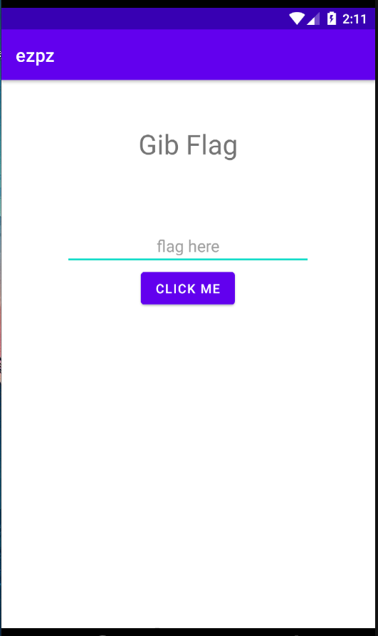

# ezpz (48 solves / 470 points)
Some easy android for ya :)

## Attachments:
* [ezpz.apk](./ezpz.apk)

## Solution

On running the app this is the UI which only have input text but doesnt do anything other than the dancing submit button xD



So on reversing the apk we get some java files by following the source code for flag checking in `MainActivity.java` we can see that it is checking the input with `YEET` variable which from `whyAmIHere` class so following the `whyAmIHere` file we get that the flag is actually fetched from firestore (kinda of db in firebase) and is forwarded to `Log.d()` which is typical logger in android with TAG as `TypicalLogcat`

```java
public class whyAmIHere  {

    public String[] isThisWhatUWant() {
        final String[] justAWaytoMakeAsynctoSync = {""};
        FirebaseFirestore freeOnlineDatabaseYEEEET = FirebaseFirestore.getInstance();
        freeOnlineDatabaseYEEEET.collection("A_Collection_Is_A_Set_Of_Data").get().addOnSuccessListener(new OnSuccessListener<QuerySnapshot>() {
            @Override
            public void onSuccess(QuerySnapshot queryDocumentSnapshots) {
                    for(DocumentSnapshot snapshot : queryDocumentSnapshots){
                        justAWaytoMakeAsynctoSync[0] = snapshot.getString("Points");
                        Log.d("TypicalLogcat",justAWaytoMakeAsynctoSync[0]);
                    }
            }
        }).addOnFailureListener(new OnFailureListener() {
            @Override
            public void onFailure(@NonNull Exception e) {
                justAWaytoMakeAsynctoSync[0] = "Something Failed,Maybe Contact Author?";
            }
        });
        return justAWaytoMakeAsynctoSync;
    }

}
```

So by using adb we can check for `TypicalLogcat` from logcat debug message and we get the flag


```bash
D:\Useless Tools\Geneymotion\tools>adb logcat | FINDSTR TypicalLogcat
02-21 13:52:11.599  2162  2162 D TypicalLogcat: darkCON{d3bug_m5g_1n_pr0duct10n_1s_b4d}
```

## Flag
> darkCON{d3bug_m5g_1n_pr0duct10n_1s_b4d}